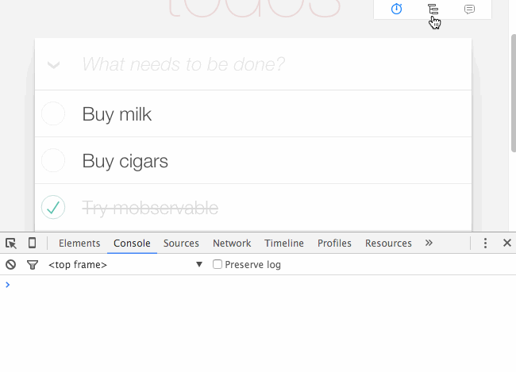

# Instructions

1. Clone the contents of this repository and get it running locally. 

2. Review the code and get an understanding of how it works.

3. Add the following customization: Enable users to specify one or more tags in order to categorize todo items. 

> Example: if I create a todo item with the text `Contact candidates to explain the coding exercise`, I might want to add a couple tags, for example `Hiring` and `Urgent`.

4. Add an additional row of filter buttons to the footer, with one for each unique tag that's been added to any items. 

> Example: once I've added `Urgent`, and `Hiring` tags to one or more items, I should see two new filter buttons (one for `Urgent`, one for `Hiring`) and when I click one of these buttons it should filter the list of visible todos to only those with the corresponding tag.

5. Submit a pull request containing your code changes.

There are various packages that provide a React-based component for adding/selecting tags and you are welcome to use such a package, but please do not go overboard on changing the code beyond what is required. Small improvements or styling flourishes are fine, but re-writing the entire application or adding unnecessary features is discouraged.


## Running the example

```
npm install
npm start
open http://localhost:3000
```

The example requires node 4.0 or higher




## Help!

If you are new to MobX, take a look at the [ten minutes, interactive introduction](https://mobxjs.github.io/mobx/getting-started.html) to MobX and React. MobX provides a refreshing way to manage your app state by combining mutable data structures with transparent reactive programming.

The state and actions of this app are defined in two stores; `todoModel` and `viewModel`.
This is not necessary but it provides a nice separation of concerns between data that effects the domain of the application and data that affects the user interface of the application.
This is a useful distinction for testing, reuse in backend services etc.

The project uses hot-reloading so most changes made to the app will be picked automatically.
By default the `mobx-react-devtools` are enabled as well. During each rendering a small render report is printed on all updated components.
The dev-tools can be disabled by commenting the `import` statement in `src/index.js`.
